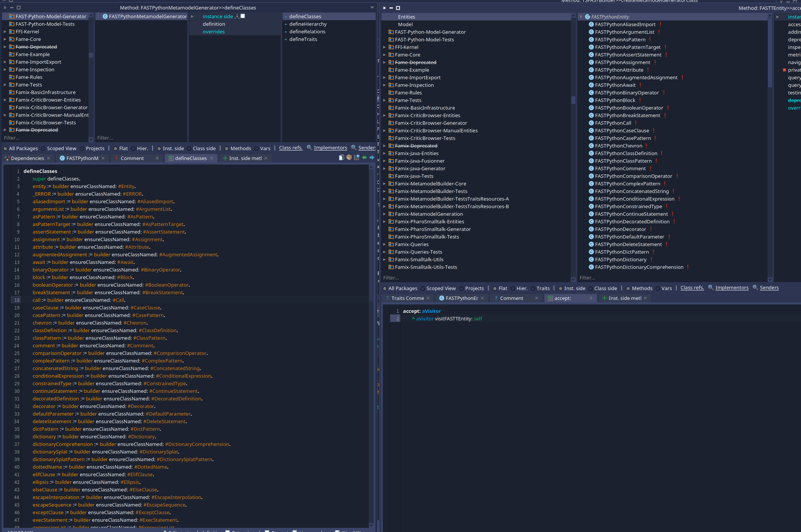
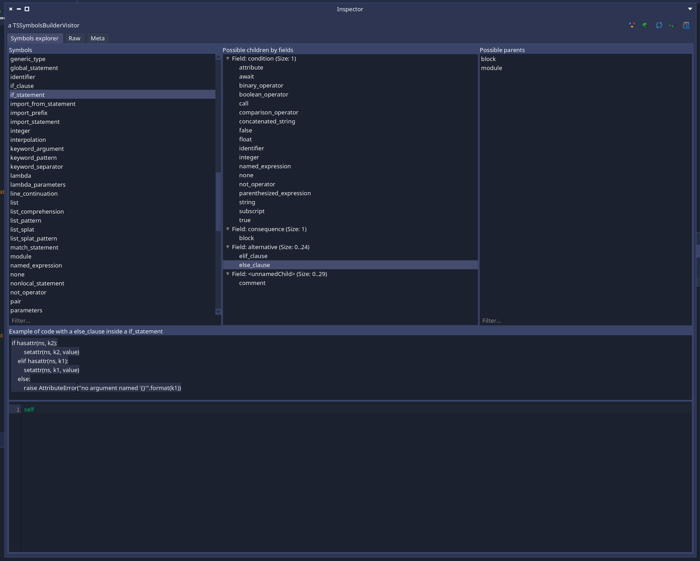

# Create a FAST importer with TreeSitter

This section covers the content of the package `TreeSitter-FAST-Utils` and explain how to use it to create a [FAST model](https://modularmoose.org/users/ast/fast/) for the [`Moose plateform`](https://github.com/moosetechnology/Moose).

> [!NOTE]
> Here is some context for this documentation: It was produced after a new iteration over the FAST importer of TreeSitter and the production of [FAST-Python](https://github.com/moosetechnology/FAST-Python). Multiple utilities got extracted from `FAST-Python` to `pharo-tree-sitter`. This documentation explains as if all those utilities were present in `pharo-tree-sitter` before `FAST-Python` was started and most of the examples provided here will be from `FAST-Python`. 

<!-- TOC -->

- [Create a FAST importer with TreeSitter](#create-a-fast-importer-with-treesitter)
  - [Some context](#some-context)
  - [Get a working baisc FAST importer](#get-a-working-baisc-fast-importer)
    - [Install TreeSitter](#install-treesitter)
    - [Generate the base of the Metamodel](#generate-the-base-of-the-metamodel)
    - [Implement the importer](#implement-the-importer)
  - [Customize your metamodel and visitor](#customize-your-metamodel-and-visitor)
    - [Improve relations management](#improve-relations-management)
    - [Implement a specialized visitor](#implement-a-specialized-visitor)
      - [Specialized visit methods](#specialized-visit-methods)
      - [Change the class produced by a node](#change-the-class-produced-by-a-node)
      - [Handle the parent/children relation yourself](#handle-the-parentchildren-relation-yourself)
      - [The context management](#the-context-management)
      - [Customize fields relation name matching](#customize-fields-relation-name-matching)
      - [Manage properties](#manage-properties)
  - [Add regression tests to your project](#add-regression-tests-to-your-project)
  - [Cyril's tips on how to work](#cyrils-tips-on-how-to-work)

<!-- /TOC -->
<!-- /TOC -->

## Some context

This documentation assume you are already familiar with:

- Tree-Sitter
- Pharo-Tree-Sitter
- FAST
- Metamodel generators

> [!IMPORTANT]
> If you are not, the following provides a general introduction to these tools/libraries along with references for further details:
> - **[Tree-Sitter](https://tree-sitter.github.io/tree-sitter/)** is a parser generator tool and an incremental parsing library. It can build a concrete syntax tree for a source file and efficiently update the syntax tree as the source file is edited. It is able to parse a large variety of programming languages such as Java, C++, C#, Python and many others.
> - **[Pharo-Tree-Sitter](https://github.com/Evref-BL/Pharo-Tree-Sitter/)** the project containing the FAST importer infrastructure. It is developed in Pharo and integrates the original Tree-Sitter parsers and allows visualizing their results (such as ASTs) directly in Pharo. It relies on the FFI protocol, which requires the corresponding libraries depending on the OS (.dll, .so, or .pylib) to be present in Pharo’s VM folders.
> The project supports parsing several languages, and for some of them (like Python, TypeScript, and C), the library generation is automated. You can find more details in the README.
> This is the project that we will use to generate a new FAST-Language metamodel, so you need to download it into your Pharo image.
> - **[FAST](https://github.com/moosetechnology/fast)** means Famix AST. Contrary to Famix that represent application at a high abstraction level, FAST uses a low-level representation: the AST.
> FAST defines a set of traits that can be used to create new meta-models compatible with Moose tools.
> When developing a new FAST-Language metamodel, you will rely on these FAST traits to structure your metamodel.
> - **[Metamodel generator](https://modularmoose.org/developers/create-new-metamodel/)** is a Pharo library used to create new metamodels such as FAST-Java, Famix-Java, or FAST-Fortran.
> The generation of any new version of a FAST-Language metamodel can only be achieved through the metamodel generator.
> As you will see in this post, Pharo-Tree-Sitter enables you to define a new metamodel generator. Once executed, it produces the corresponding FAST-Language metamodel. We will explain this process in more detail in the following sections.


## Get a working baisc FAST importer 

### Install TreeSitter

First you need to create a Moose image and download [Pharo-Tree-Sitter](https://github.com/Evref-BL/Pharo-Tree-Sitter/):

```smalltalk
Metacello new
  baseline: 'TreeSitter';
  repository: 'github://Evref-BL/Pharo-Tree-Sitter:main/src';
  load.
```

Once you project has a baseline, you need to add tree sitter as a dependency:

```smalltalk
spec
	baseline: 'TreeSitter'
	with: [ spec repository: 'github://Evref-BL/Pharo-Tree-Sitter:main/src' ]
```

Once downloaded, you need to make sure that `Pharo-Tree-Sitter` is able to parse the language that you intend to create the metamodel for.
If it is not included, you need to follow the instructions in the readme file of this repository and add the new language.
For this documentation we will assume that the language is already supported and we will continue with "Python" 🐍🐍🐍.

To be able to continue, and if this is the first time you're using `pharo-tree-sitter`, you need to launch the tests of python in package `TreeSitter-Tests` class `TSParserPythonTest`.
This is needed to launch the process of downloading the original **[tree-sitter](https://github.com/tree-sitter/tree-sitter)** and **[tree-sitter-python](github.com/tree-sitter/tree-sitter-python)** projects from GitHub, generating the correspondent libraries.

Now that you have the libraries, you can parse python code and get an AST corresponding to the tree-sitter grammar, but not FAST-Python model. The next step will be to generate a basic FAST metamodel for our language.

### Generate the base of the Metamodel

It is possible to generate a first basic version of the FAST model using this the `TSFASTBuilder` like this:

```smalltalk
TSFASTBuilder new
    languageName: 'Python';
    tsLanguage: TSLanguage python;
    build.
```

The language name is used for the prefix of the class names. They are on the form of `FASTPrefixSymbol` like `FASTPyFunctionDefinition`.

The tsLanguage is the tree sitter language to use to retrieve the possible symbols.

Once this code is executed, a new FAST generator will be in your image and you can generate the classes with it:

```smalltalk
FASTPythonMetamodelGenerator generate
```

Example of generated code:



In this generated metamodel, only one relation exist between any entities from #`genericChildren` to #`genericParent`. This relation is used to manage all relations in this basic importer. We will be able to improve this later.

> [!TIP]
> The metamodel generated is only a base. It has a class for each element of the syntax but it has no hierarchy, no trait usage, no specific relations and no properties. We provide an explanation of the possible customizations in the section: [customize your metamodel and visitor](#customize-your-metamodel-and-visitor).

### Implement the importer

Now that we have a basic metamodel, we can import a FAST model like this:

```Smalltalk
| parser tsLanguage importer |

parser := TSParser new.
tsLanguage := TSLanguage python.
parser language: tsLanguage.
string := 'if x > 0:
    if x < 10:
        1
    else:
        2
else:
    3'.

importer := TSFASTImporter new.
importer tsLanguage: tsLanguage.
importer languageName: 'Python'.
importer originString: string.

^ importer import: (parser parseString: string) rootNode
```

This is not really practical so it is recommended to implement a subclass of `TSFASTAbsractImporter`.

For example for Python:

```Smalltalk
TSFASTAbstractImporter << #FASTPythonImporter
	slots: {};
	package: 'FAST-Python-Tools'
```

Once we have this class, we just need to implement the method `tsLanguage` to make it work. 

```Smalltalk
FASTPythonImporter>>tsLanguage

	^ TSLanguage python
```

And the previous script can now be replaced by:

```Smalltalk
FASTPythonImporter parse: 'if x > 0:
    if x < 10:
        1
    else:
        2
else:
    3'
```

or: 

```Smalltalk
FASTPythonImporter parseFile: 'myFile.py'
```

## Customize your metamodel and visitor

> [!WARNING]
This documentation expects the reader to know how to develop a Moose metamodel generator. If this is not the case, you will need to learn how to handle entities hirerachy, relations between entities, properties declaration and hanlding of traits in order to fully understant this section. [See documentation.](https://modularmoose.org/developers/create-new-metamodel/)

> [!WARNING]
When you update your generator (`FASTPythonMetamodelGenerator` in this documentation), do not forget to regenerate your metamodel.

We are now able to have a FAST model, but this models has multiple limitations such has:
- There is no management of inheritance and usage of traits in FAST entities
- The relations are all stored in #`genericChildren` and #`genericParent` relation
- There is no property
- The AST of the tree-sitter grammar does not necessarily make a good AST and some nodes could gain to be customized

In some cases, the model produce can be enough. This project was originally done in order to do pattern matching and have a good AST is not necessary. But, in order to use most Moose's tooling, we need to improve the generated code. 

Thus, this project provides a set a tools to customize our Metamodel and Importer.

### Improve relations management

A first way to improve the model is to improve the FAST generator and use specific relations instead of the generic one we generated.

In order to create a FAST model, the importer will first use tree sitter to obtain a `TSTree`. This tree represent the AST of the source code parsed. We then visit its nodes to generate the FAST model.

The `TSNodes` of the tree are grouping their children by `fields`.

For example, we can see on the result of a tool we will explain later in the documentation:



Here we see `if_statement` nodes have 4 fields:
- `condition` that always have 1 child
- `consequence` that always have 1 child
- `alternative` that is optional and can have multiple children
- an unnamed field that is optional and can have multiple children

If the name a field matches the name of a Fame property (in the Moose description), then this relation will be used.

In the case of our `if_statement`, the FAST node representing it should use `FASTTWithCondition` and store the condition expression into the `condition` relation.

If order to do this, we need to retrieve `FASTTWithCondition` in our generator and make the `ifStatment` use it.

```Smalltalk
FASTPythonMetamodelGenerator>>defineTraits

    super defineTraits.

    tWithCondition := self remoteTrait: #TWithCondition withPrefix: #FAST
```

```Smalltalk
FASTPythonMetamodelGenerator>>defineHierarchy

    super defineHierarchy.

    ifStatment --|> tWithCondition
```

> [!TIP]
> Do not forget to regenerate your metamodel afterward by executing `FASTPythonMetamodelGenerator generate`

> [!NOTE]
> The importer will check if the relation used is multivalued or not. In case it is monovalue, it will use the setter. If it is multivalued, it will use `#addRelationName:`.

This method is good because we just need to improve the metamodel generator to make it work. But it has its limits:
- Some fields are unnamed and cannot be mapped directly to a fame relation
- Some fileds are good names for a basic AST, but not good in an AST specialized for software analysis such as in Moose. For example, the left side of an asssignment can be named `left` in tree sitter, but should be named `variable` in a FAST model. Or a field can be named `expression` in tree sitter because it can contain one or multiple expression. But in Moose, a multivalued relation should be plurial and we need the relation to be named `expressions`.

In order to make further improvements, we can use `TSFASTCustomizableVisitor`.

### Implement a specialized visitor

In order to apply more customizations to your FAST model, we will need to subclass `TSFASTCustomizableVisitor` like this:

```Smalltalk
TSFASTCustomizableVisitor << #FASTPythonVisitor
	slots: {};
	package: 'FAST-Python-Tools'
```

It should have an initialize method to specify the language:

```Smalltalk
initialize

	super initialize.
	self languageName: 'Python'
```

Then you need to indicate to your importer that it needs to use this visitor.

```Smalltalk
FASTPythonImporter>>visitorClass

	^ FASTPythonVisitor
```

We now have the possibility to apply a new set of customizations that are explained in the next sections. 

> [!NOTE]
> Each section will assume that you have read the previous sections. This means that everything in the examples provided will have been explained.

#### Specialized visit methods

By default, `TSVisitor` has only one visit method: `#visitNode:`. This is a limitation while developping an importer. Your new visitor is able to lift this limitation. 

We can use the type of a `TSNode` to implement a custom visit method. The visit method you implement should begin by `visit`, then the type in camel case format and the method takes one parameter: the `TSNode`. 

For example, in python the `TSNode` for a string is of type `string` and has 3 children:
- `string_start`
- `string_content`
- `string_end`

The generator has `FASTPythonString`, `FASTPythonStringStart`, `FASTPythonStringContent` and `FASTPythonStringEnd`.

Those nodes are useless to us since we just need the String node. 

In that case, we can remove the declaration of the 3 children in `FASTPtyhonMetamodelGenerator>>#defineClasses` and regenerate and we can modify the visitor to not produce any node for those 3 `TSNodes`. 

```Smalltalk
FASTPythonVisitor>>visitStringStart: aNode
	"We only want one node for the string, my parent. So I do nothing"
    
```

```Smalltalk
FASTPythonVisitor>>visitStringContent: aNode
	"We only want one node for the string, my parent. So I do nothing"
    
```

```Smalltalk
FASTPythonVisitor>>visitStringEnd: aNode
	"We only want one node for the string, my parent. So I do nothing"
    
```

We are able to implement one visit method for each node type. Here it was used to skip some nodes in the `TSTree`. Much more usages will be shown in the next sections. 

If you did not implement a specialized visit method, the visitor will backup to the basic visit:

```Smalltalk
TSFASTVisitor>>visitNode: aTSNode

    ^ self handleNode: aTSNode
```

#### Change the class produced by a node

In some cases it can be better to update the name of an entity. 

For example, the python `TSTree` represent attribute access with a node named `attribute`. This name is missleading in the context of `FAST`. We can rename the node in the generator and explicitly provide the class to the visitor.

In `FASTPythonMetamodelGenerator`, the line:

```Smalltalk
attribute := builder newClassNamed: #Attribute.
```

by:

```Smalltalk
attribute := builder newClassNamed: #AttributeAccess.
```

Now that the metamodel is updated, we need to adapt the visitor:

```Smalltalk
FASTPythonVisitor>>visitAttribute: aTSNode

	^ self handleNode: aTSNode kind: FASTPythonAttributeAccess
```

#### Handle the parent/children relation yourself

By default, when we are trying to set the parent of an entity, we are invoking the method `#setParentTo:`. This method takes as parameter the FAST entity represented by the node and will add itself in the children of the parent FAST entity. 

This method will check if we have a fame property of the same name as the field in which the node is. If yes, it will use this fame relation property to set the child in the right slot. Else it will use `#addGenericChild:`. 

Sometimes, we might need or prefer to set the parent ourselves. This is possible using:
- `#handleNode:parentBlock:`
- `#handleNode:kind:parentBlock:`

For example, in python all entities can have a comment. Comments are entities annoying to manage because they are everywhere. We could manage them all at once.

We can add this line:

```Smalltalk
FASTPythonMetamodelGenerator>>#defineTraits
    [...]
    tWithComment := self remoteTrait: #TWithComments withPrefix: #FAST.    
```

And this line:

```Smalltalk
FASTPythonMetamodelGenerator>>#defineHierarchy
    [...]
    entity --|> tWithComment    
```

Now in the visitor we can tell it that it will use `#addComment:` on its parent.

```Smalltalk
FASTPythonVisitor>>visitComment: aTSNode

	^ self handleNode: aTSNode parentBlock: [ :entity | self topFastEntity addComment: entity ]
```

or

```Smalltalk
FASTPythonVisitor>>visitComment: aTSNode

	^ self handleNode: aTSNode kind: FASTPythonComment parentBlock: [ :entity | self topFastEntity addComment: entity ]
```

Passing explicitly the class or not depend on your preference. Specifying it is a little bit faster during runtime. But the gain is often unsignificant.

> [!NOTE]
> `self topFastEntity` will return the parent of the FAST entity we are creating. The name of the method refer to the concept of context that will be explaine if the section [The context management](#the-context-management).


#### The context management

In order to be effective in our customizations, it is good to understand the context system of the visitor. 

Your visitor is maintaining a `Stack` named `context`. Its elements are `TSFASTContextEntry`. Each entry represent a node parent to the node we are visiting until we arrive at the root of the model. 

The entry will save multiple interesting informations such has:
- The fast entity produced by the node
- The `TSNode` corresponding to the context
- The filed name containing the nodes been pushed later on the stack 
- The fm property corresponding to the field been visited. If it is not nil while `setParentTo:` is been invoked, it will be use the set the parent/child relation.

This context stack explain why `topFastEntity` returns the parent of the node we are visiting. We get the top entry and we return its FAST entity.

Those info in the context will be useful to import and also to customize the importers with `TSFASTCustomizableVisitor`.

For example, in Python both method definitions and function definitions are managed by a node of type `function_definition`. But in our AST we want to distinguish them.

For that we can add a new entity:

```Smalltalk
FASTPythonMetamodelGenerator>>defineClasses
    [...]
    methodDefinition := builder newClassNamed: #MethodDefinition.
```

And we can customize our function definition visit:

```Smalltalk
FASTPythonVisitor>>visitFunctionDefinition: aNode
	"TreeSitter has the same nodes for method and function definitions but in FAST we want to disambiguate."

	^ (context anySatisfy: [ :entry | entry fastEntity isClassDefinition ])
		  ifTrue: [ self handleNode: aNode kind: FASTPyMethodDefinition ]
		  ifFalse: [ self handleNode: aNode kind: FASTPyFunctionDefinition ]
```

We can access all informations about the parent chain both in FAST entities and TS nodes.

#### Customize fields relation name matching 

As we saw in a previous sections, the way we automatically resolve the relation to use in the parent/child relations have limits. The bigest one been that field names in tree sitter and relation names in FAST needs to be the same.

The customizable visitor can use the context management to define some aliases for some fields and resolve this problem.

For example in Python the `FASTTBinaryExpression` defines `leftOperand` and `rightOperand` but the fields in the node of type `binary_operator` are called `left` and `right`. 

Once the trait has been added to `FASTPythonBinaryOperator` in the generator, here is how to manage this:

```st
FASTPythonImporter>>visitBinaryOperator: aTSNode

	| fastEntity |
	fastEntity := self instantiateFastEntity: FASTPythonBinaryOperator from: aTSNode.

	self setParentOf: fastEntity.

	self pushContext: fastEntity node: aTSNode during: [
			context top add: 'leftOperand' asAliasOfField: 'left'.
			context top add: 'rightOperand' asAliasOfField: 'right'.
			self visitChildren: aTSNode in: fastEntity ].

	^ fastEntity
```

We cans do even better by using `#onNextContextDo:`. This method allow to apply a customization to the next context we create. Allowing to add the aliases before calling the normal node method handling:

```Smalltalk
visitBinaryOperator: aTSNode

	self onNextContextDo: [ :entry |
			entry
				add: 'leftOperand' asAliasOfField: 'left';
				add: 'rightOperand' asAliasOfField: 'right' ].

	^ self handleNode: aTSNode kind: FASTPyBinaryOperator
```

A last problem solved by this alias mechanism is the case of unnamed fields. 

You can define an alias to it using `#aliasUnnamedFieldAs:`. For example, in python an assert statement has unnamed children. If we declare in the generator that an assert statement has a relation named `#expressions`, we can define:

```Smalltalk
FASTPythonVisitor>>visitAssertStatement: aTSNode

	self onNextContextDo: [ :entry | entry aliasUnnamedFieldAs: #expressions ].

	^ self handleNode: aTSNode kind: FASTPyAssertStatement
```

#### Manage properties

TODO

## Add regression tests to your project

TODO

## Cyril's tips on how to work

TODO


More:
- Error handling
- Error node
- Utilities