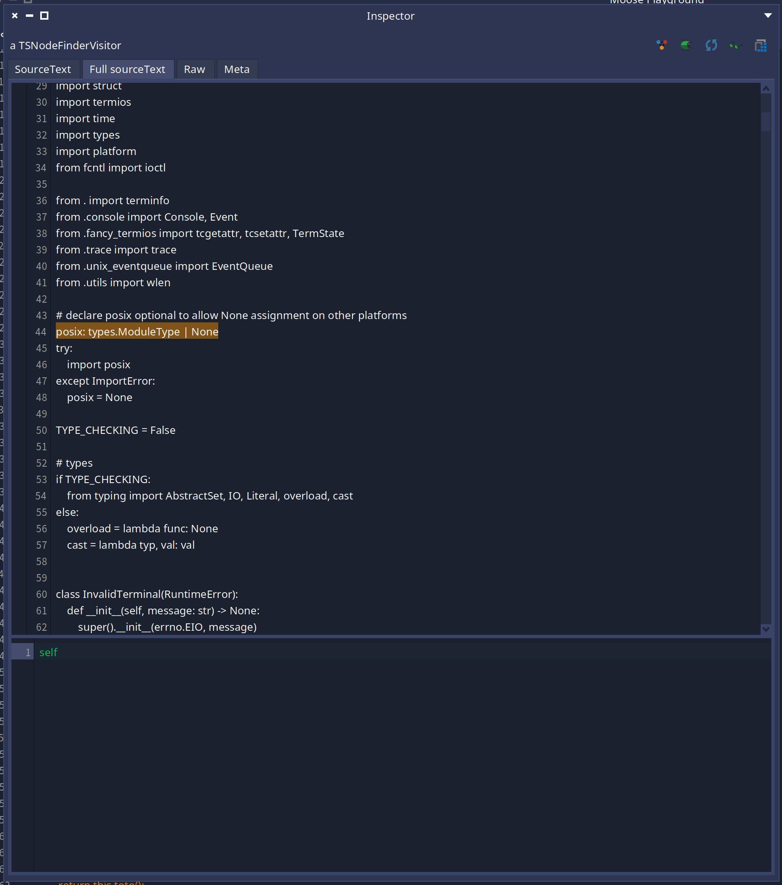

# Tree Sitter utilities

<!-- TOC -->

- [Tree Sitter utilities](#tree-sitter-utilities)
  - [Debug](#debug)
  - [Inspect the structure of you tree with TSSymbolsBuilderVisitor](#inspect-the-structure-of-you-tree-with-tssymbolsbuildervisitor)
  - [Look for a specific pattern in your tree with TSNodeFinderVisitor](#look-for-a-specific-pattern-in-your-tree-with-tsnodefindervisitor)
  - [Find the list of possible symbols of your tree](#find-the-list-of-possible-symbols-of-your-tree)

<!-- /TOC -->

## Debug 

You might want to debug a tree sitter parser from Pharo.
Whereas we did not find _yet_ a way to use the pharo debugger.
You can create a logger attached to the parser.

```st
callback := (TSLogCallback on: [ :payload :log_type :buffer | Transcript crShow: buffer ]).
logger := TSLogger new log: callback .
parser logger: logger.
```

## Inspect the structure of you tree with TSSymbolsBuilderVisitor

This section will describe `TSSymbolsBuilderVisitor`. It is a little visitor used to understand the structure of TS nodes present in the tree you are managing.

You can use it like this: 

```smalltalk
	folder := '/Users/cyril/testPython/cpython-main' asFileReference.
	TSSymbolsBuilderVisitor language: TSLanguage python extensions: #( 'py' ) buildOn: folder
```

And you will get a result like this: 


This inspector allow you to see multiple information:
- All the nodes types present in the source code parsed
- All the fields present in each node type
- The node types found in each symbols
- The cardinality of the children (for example, if you are in a node and it always have 1 child in a field, it will display `Size: 1`. If it happened there was nothing in this field in some cases and once you got 12 children in the same field, it will display: `Size: 0..12`
- By selecting a child node type, we can see an example of code with the configuration selected
- The list of possible node types in which the symbol was found

For example, here we see at the left the list of node types found in CPython. One of them is `if_statement` and it can have 4 fields:
- `condition` that always have 1 child
- `consequence` that always have 1 child
- `alternative` that is optional and can have multiple children
- an unnamed field that is optional and can have multiple children

We can also see a piece of code of an `else_clause` is an `alterative` field.

> Note: Be careful, you are not guarantee to have all possible child and parents since it will produce the mapping from what it encounters in the files you will provide. To be more accurate, give it the maximum number of sources possible.

## Look for a specific pattern in your tree with TSNodeFinderVisitor

Sometime we can find some possible patterns in the nodes but we do not know what kind of code can produce it. `TSNodeFinderVisitor` is here for this. 

This visitor can be configured with a condition to match on a node and it will inspect the first node matching it. It will also display its source code and the source code of the node highlighted in the full source.

For example, I got suprised to find that the python `asssignment` node has the `right` field optional and I wanted to find in which case this can happen:

```smalltalk
    TSNodeFinderVisitor
        language: TSLanguage python
        extensions: #( 'py' )
        selection: [ :node | node type = #assignment and: [ node collectFieldNameOfNamedChild at: #right  ifPresent: [ :node | false ] ifAbsent: [ true ] ] ]
        buildOn: '/Users/cyril/testPython/cpython-main' asFileReference.
```

This will produce this:



## Find the list of possible symbols of your tree

It is possible to extract the full list of symbols that can appear in a tree for a specific language executing this piece of code:

```smalltalk
(TSLanguage python symbolsOfType: TSSymbolType tssymboltyperegular) collect: [ :s | TSLanguage python nameOfSymbol: s ]
```